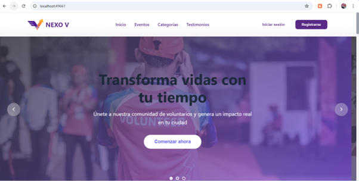
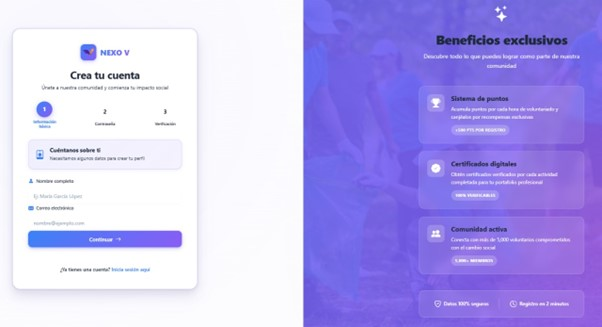
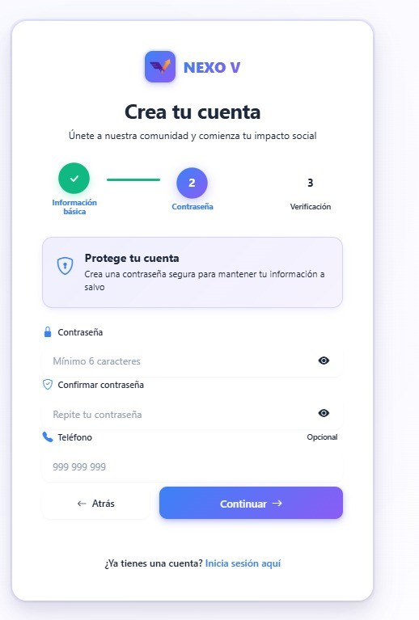
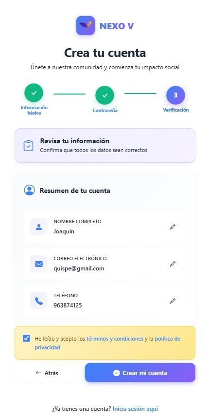
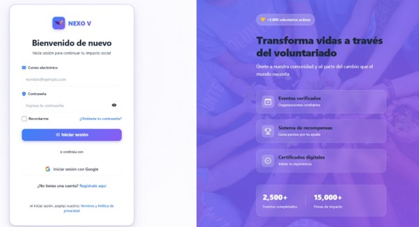
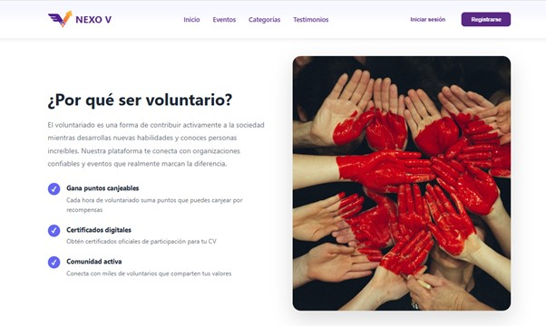
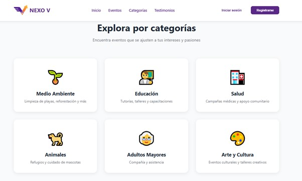
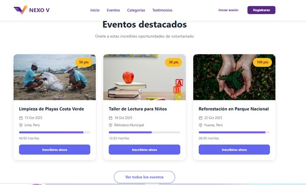
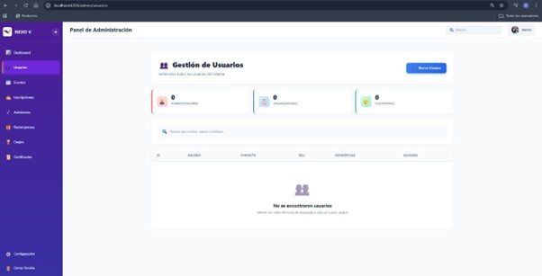

# Sistema web - Nexo V (Gestión de Voluntariado)


## 📋 Índice

- [Descripción del proyecto](#descripción-del-proyecto)
- [Estado del proyecto](#estado-del-proyecto)
- [Características de la aplicación y demostración](#características-de-la-aplicación-y-demostración)
- [Acceso al proyecto](#acceso-al-proyecto)
- [Tecnologías utilizadas](#tecnologías-utilizadas)
- [Personas Desarrolladores del Proyecto](#personas-desarrolladores-del-proyecto)
- [Conclusión](#conclusión)
- [Bibliografía](#bibliografía)

## 📖 Descripción del proyecto

[cite_start]Este proyecto, denominado **Nexo V**, es una plataforma web integral diseñada para democratizar y optimizar la gestión del voluntariado[cite: 50, 46]. [cite_start]Surge en un contexto donde los métodos tradicionales son manuales y fragmentados, y responde a la necesidad de cumplir con la **Ley N° 32396**, promulgada el 1 de julio de 2025, la cual reconoce el voluntariado con créditos académicos y beneficios estatales[cite: 36, 40].

[cite_start]El sistema está desarrollado utilizando **Spring Boot 3.5.5** para el backend y **Angular** para el frontend, conectado a una base de datos **MySQL**[cite: 50, 85, 93].

La propuesta de valor incluye:
* [cite_start]**Gamificación:** Sistema de puntos y recompensas para motivar a los voluntarios[cite: 55].
* [cite_start]**Roles:** Gestión diferenciada para Administradores, Organizadores y Voluntarios[cite: 59].
* [cite_start]**Certificación:** Emisión automatizada de certificados válidos por ley[cite: 47].

## 🔍 Estado del proyecto


El proyecto ha completado la fase de **Avance del Proyecto Final**. [cite_start]Se han implementado las ramas para el Home-Page, mejoras en el backend, integración de la base de datos y la funcionalidad de canje de productos [cite: 6, 92-95].

## ✨ Características de la aplicación y demostración

### 🏠 Página Principal (Landing Page)
Muestra la propuesta de valor y eventos destacados.


[cite_start]*(Captura: Página Principal Nexo V)* [cite: 100]

### 🔑 Login y Registro
El sistema permite un registro en 3 pasos y un inicio de sesión seguro.






[cite_start]*(Captura: Registro en 3 pasos)* [cite: 101]


[cite_start]*(Captura: Despues de registrar la cuenta nos logueamos)* [cite: 102]

### 👤 Beneficios acerca de la página voluntariado

- [cite_start]**Beneficios acerca de la página**: Permite visualizar los beneficios de usar nuestra página web para nuestros usuarios[cite: 104, 105].



### 👤 Sección de categorias

- [cite_start]**Categorias**: Permite explorar los eventos que se ajusten a los interéses  pasiones de nuestros usuarios[cite: 104, 105].



### 👤 Sección de eventos

- [cite_start]**Eventos**: Se visualiza los eventos destacados según los gustos de los clientes[cite: 104, 105].



### 👤 Panel de Progreso

- [cite_start]**Panel de Progreso (Gamificación)**: El usuario puede ver sus puntos acumulados, horas de voluntariado y eventos asistidos[cite: 114].


### 👤 Catalogo de recompensas

- [cite_start]**Catálogo de Recompensas**: Permite canjear puntos por productos (ej. camisetas, entradas)[cite: 117].


### 👔 Administrador

- [cite_start]**Panel de Administración**: Gestión completa de usuarios (Administradores, Organizadores, Voluntarios) y métricas del sistema[cite: 109].



- [cite_start]**Gestión de Inscripciones y Canjes**: Aprobación o rechazo de solicitudes de voluntariado y entrega de recompensas[cite: 111, 113].


## 🔗 Acceso al proyecto

1. Clona el repositorio:

   ```bash
   git clone [https://github.com/JSobero/voluntariado.git](https://github.com/JSobero/voluntariado.git)

## 💻 Tecnologías utilizadas

*

*

*

*

*

*

*

## 👥 Personas Desarrolladores del Proyecto

* Joaquin Pomayay - Lider del Proyecto - [JSobero](https://github.com/JSobero)
* Joao Inga - Sub lider - [Spaurhu](https://github.com/Spaurhu)
* Hector Reyes - Asistente 1 - [HectorReyes20](https://github.com/HectorReyes20)
* Rodrigo Tinco - Asistente 2 - [Rodrigo1304-RMA](https://github.com/Rodrigo1304-RMA)

## 📝 Conclusión

[cite_start]El proyecto "Sistema web - Nexo V" está diseñado para facilitar la gestión integral de programas de voluntariado, abarcando desde la administración de eventos y usuarios hasta la emisión de certificados válidos por la Ley N° 32396[cite: 50, 51, 52]. [cite_start]Utilizando tecnologías como Spring Boot, Angular, MySQL y Java, este sistema busca optimizar los procesos administrativos, mejorar la motivación de los participantes mediante gamificación y proporcionar una experiencia segura y transparente[cite: 50, 54, 58]. [cite_start]Su enfoque en la innovación y el cumplimiento normativo promete convertirse en una herramienta esencial para la formalización y reconocimiento del voluntariado[cite: 123, 124].
